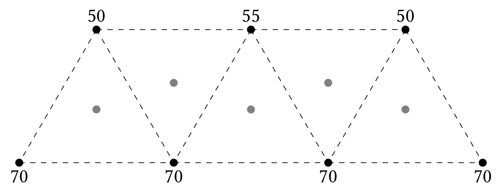

# brachytime

A simple Python utility to compute the treatment time for an interstitial applicator with wires forming the vertices of equilateral triangles in its midplane.

A suitable applicator geometry is as shown below, with wire lengths (vertices of the equilateral triangles, denoted by black dots) in millimetres. The basal dose points are denoted by grey dots.



# usage

The treatment time may be computed using expressions such as

```Python
>>> brachytime.treattime(sep=18, ulens=[50,55,55], llens=[70]*4, delakr=0.494, deltime='2000-11-17T12:00', midtime='2000-11-22T18:40', halflife=6379000, presc=20)
```
where the separation (the side of the triangle) and the lengths of the wires in the upper and lower planes are expressed in millimetres, the source air kerma rate at time of delivery is expressed in micrograys per hour per millimetre metre squared, the souce isotope half-life is expressed in seconds, and the prescribed dose is expressed in grays. The source delivery time and the mid-implant time must be passed as strings formatted according to ISO 8601, ''i.e.'' YYYY-MM-DDTHH:MM. Without loss of generality, it is assumed that the lower row of wires has at least as many wires as the upper row, and that the leftmost wire is in the lower row (since this is taken to be the origin of the coordinate system, for convenience). All wire lengths must be in the range 50 mm to 70 mm.
